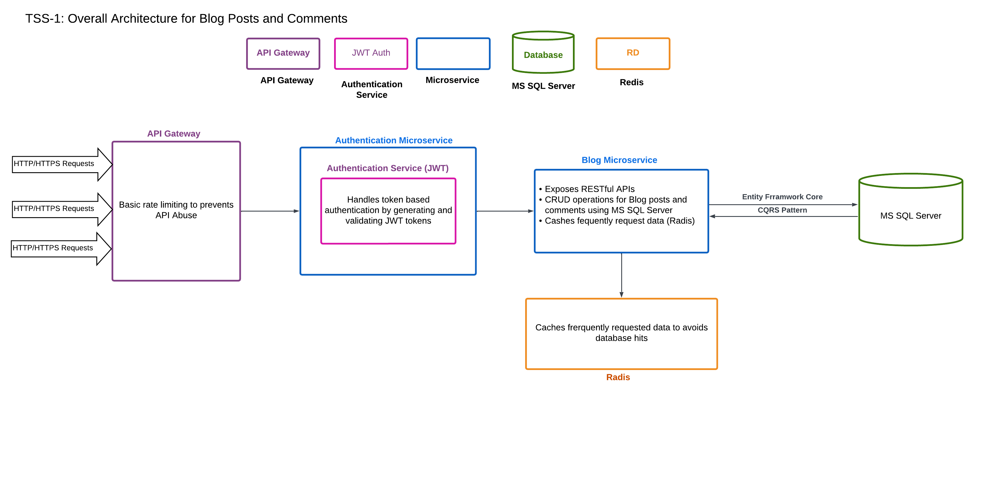

# Microservices-based Blog Platform

## Overview

This project outlines the conceptualization and high-level design of a microservices-based platform for managing blog posts and comments using C# .NET Cor.

## Architecture

### Architectural Diagram

### High-Level Overview

#### Blog Service (Microservice):
Contains following components 
- **API Layer:** Exposes RESTful endpoints for managing blog posts and comments.
- **Business Logic:** Handles the core functionality of creating, updating, and retrieving blog posts and comments.
- **Data Access:** It utilize the database using Databse Layer by utlizing CQRS pattern
- **Caching Layer :** Uses Caching Layer to cache frequently requested data like blog posts and comments to enhance performance.

#### Authentication Layer:

- Responsible for token-based authentication by generates and validates tokens for basic authentication

#### API Gateway:

- Acts as a central entry point for clients.
- Request Lands on the it before getting into Blog Microserivce..
- Implements basic rate limiting to prevent API abuse.

### Databse Layer:

- Utilizes Entity Framework Core to interact with a SQL Server database for data persistence.
- Defines entities for blog posts and comments, establishing relationships between them in the database.
- Uses the code first migration to handle the updates made to the database models

### Caching Layer:
- Uses Redis to cache data.

## Why This Design Preferred

- Using microservices allows modular development, scalability, and maintenance, as each microservice can be independently developed and deployed.
- The API Gateway centralizes control over rate limiting, simplifying client interactions and providing a unified API.
- Entity Framework Core simplifies data access and ensures compatibility with SQL Server, a popular and reliable database platform.
- Caching (Redis) improves performance by reducing the load on the database, ensuring a smoother user experience.
- Token-based authentication with JWT is a widely used and secure method for authenticating clients.
- Implementing the CQRS pattern optimizes performance and scalability by separating command (write) and query (read) operations within the Blog Service.

## Getting Started
This project is setup to run in the docker envoinment.
Oncce doker is running, run following commands one after another in the terminal.
- docker-compose build
- docker-compose up
